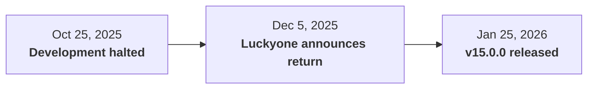
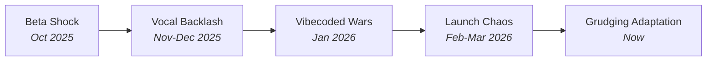

# Cutting Edge: What's Pushing Boundaries Right Now

!!! abstract "March 2026 -- Dispatches from the addon trenches"
    Midnight launched on March 2, 2026 with what the community has dubbed **"The Great Addon Purge of 2026"** -- the most aggressive set of addon API restrictions in WoW's 20-year history. Game Director Ion Hazzikostas formally called it **"Addon Disarmament."** Some addons adapted. Some refused. Some died. And a few new ones were born from the wreckage. Here's where the front lines are right now.

---

## The Scorecard: Who Survived, Who Didn't

Before diving into details, here's where the major addons stand as of March 2026:

### :material-skull: Dead or Effectively Dead

| Addon | What Happened |
|---|---|
| **WeakAuras** (combat) | Team refused to ship a stripped version. [Official statement on Patreon](https://www.patreon.com/posts/midnight-144610594): "We don't currently plan to release a WeakAuras version for Midnight." Non-combat auras may still function outside instances. |
| **Hekili** (rotation helper) | Fundamentally impossible under Secret Values. Rotation helpers are exactly what Blizzard targeted. |
| **GTFO** | Cannot detect ground effects under Secret Values. Non-functional post-Midnight. |
| **Shadowed Unit Frames** | Legacy unit frames broken by 12.0 API changes. No active development. |
| **Z-Perl** | Legacy unit frames broken. No active development. |
| **Enhanced Raid Frames** | [Ceased functioning](https://www.curseforge.com/wow/addons/enhanced-raid-frames) due to Midnight addon changes. |
| **QuaziiUI** | Developer nuked Patreon, Discord, and YouTube after plagiarism accusations (January 2026). |
| **NephUI** | Shut down January 23, 2026 amid code theft accusations. |

### :material-check-circle: Survived (Reduced)

| Addon | Status |
|---|---|
| **DBM** | v12.0.30 (Mar 12, 2026). Custom timers, audio alerts. MysticalOS met directly with Ion Hazzikostas. Supports Manaforge, Voidspire, Dreamrift, March on Quel'Danas. |
| **BigWigs / LittleWigs** | Updated Mar 12, 2026. 183.2M+ downloads. Reformats native boss timeline with custom visuals/sounds. LittleWigs handles dungeons/delves. |
| **Details!** | 330M+ downloads on CurseForge. Now functionally a skin over Blizzard's meter data. |
| **ElvUI** | v15.0.0 shipped after dramatic reversal -- initially cancelled in October 2025, returned December 2025. Style Filters and Portraits **removed**. |
| **Plater** | v635 (Mar 4, 2026). Shipping but heavily reduced. NPC-specific coloring, aura-based scaling, fixate detection -- all gone. Many old Wago profiles don't work. |
| **Cell** (raid frames) | Most technically thorough adaptation. [PR #457 on GitHub](https://github.com/enderneko/Cell/pull/457) is a masterclass in Secret Values migration. |
| **MRT** | v5260 for 12.0.1. The backbone of organized raiding -- cooldown tracking, notes, assignments all working. |
| **OPie** | [Updated for Midnight Pre-Patch](https://www.wowhead.com/news/opie-addon-updated-for-midnight-pre-patch-380234) (February 5, 2026). |

### :material-star-shooting: Rising Stars

| Addon | Category | Detail |
|---|---|---|
| **Northern Sky Raid Tools** | Raid tools | 3.2M+ downloads. Replaces WeakAura raid packs with timer-based reminders within API constraints. |
| **HomeBound** | Housing | v1.32. The must-have addon for Midnight's new player housing system. |
| **Platynator** | Nameplates | Built from scratch for Midnight's constraints. The "design within the box" philosophy. |
| **Arc UI** | Cooldown Manager | Custom glow, orientation, DoT/charge tracking for Blizzard's native Cooldown Manager. |
| **OmniCD** | Cooldown tracking | Emerged as practical WeakAuras replacement for group cooldown tracking. |
| **Better Timeline** | Boss timeline | [Standalone addon](https://www.wowhead.com/news/boss-mod-addons-in-midnight-teaching-old-mods-new-tricks-380024) based on the popular RaidAbilityTimeline WeakAura. For players wanting more control than Blizzard's default. |
| **Harreks Raid Frames** | Healer frames | New addon for [tracking healer buffs on raid frames](https://www.wowhead.com/news/how-to-track-some-healer-buffs-on-raid-frames-in-midnight-using-harreks-raid-380345) in Midnight. |
| **MoneyFrameFix** | Bug fix | Patches Blizzard's own LUA error -- vendor prices were incorrectly hidden by Secret Values in combat. |
| **Danders Frames** | Healer frames | Emerging VuhDo replacement. Recommended in community threads as "probably the best of the bunch." |
| **MidnightNameplates** | Nameplates | By D4KiR. 5,100+ downloads. Replaces default nameplates, shows debuffs. |
| **Housing Decor Guide** | Housing | Tracks all 1,690 housing decor items with multiple version updates. |
| **Advanced Decoration Tools** | Housing | Copy/paste (Ctrl+C/V), batch placement, Minecraft-style QuickBar, smart rotation. By No-String1034. |
| **HandyNotes: Midnight** | Exploration | Expansion-specific HandyNotes plugin for Midnight content. |

---

## WeakAuras: The Addon That Said No

!!! danger "Status: No Midnight version exists. Development discontinued for combat use."
    **Developer:** The WeakAuras Team &middot; **Platform:** Wago.io, CurseForge

This is the biggest story in Midnight's addon landscape. WeakAuras -- the Swiss Army knife used by millions of players -- **refused to ship a Midnight version**.

!!! warning "WeakAuras actively detects the Midnight client and refuses to boot"
    Rather than spewing thousands of errors, the addon now detects the Midnight client and refuses to load entirely. It still works in The War Within content and WoW Classic (MoP Classic, Anniversary Edition).

### Why It's Impossible (Not Just Hard)

The WeakAuras team's [Patreon statement](https://www.patreon.com/posts/midnight-144610594), [PCGamesN interview with Stanzilla (project lead, 15+ years)](https://www.pcgamesn.com/world-of-warcraft/midnight-weakauras-interview-stanzilla), and subsequent [Wowhead coverage](https://www.wowhead.com/news/no-weakauras-addon-for-midnight-378740) laid it out plainly: Secret Values destroy the addon's core architecture. Stanzilla: *"the core value proposition of WeakAuras isn't compatible with the direction Blizzard is taking the game."* WeakAuras' power comes from **conditional triggers** -- "if health below X, glow icon," "if debuff count equals Y, play sound." Under Secret Values:

- Cannot glow an icon when a cooldown is ready
- Cannot change a health bar color based on low health
- Cannot trigger audio/visual cues from buff/debuff state
- Cannot combine multiple data sources into compound triggers

The team stated that "producing a stripped-down version without these features would require several months of refactoring" and the result would be **"nearly useless."**

### What Would Bring Them Back

The WeakAuras team listed three conditions that could change their mind:

1. Ability to **compute new secret values from existing ones** (e.g., `secretA + secretB = secretC`)
2. **Reverting restrictions for personal combat state only** (not other players)
3. Complete reversal of the system (deemed unlikely)

!!! warning "Even after Blizzard loosened restrictions multiple times, the WeakAuras team's position hasn't changed"
    [Icy Veins reported](https://www.icy-veins.com/wow/news/weakauras-responds-to-addon-limitation-loosening-in-midnight/) that the team evaluated each round of loosening and concluded none addressed the fundamental architectural problem. As of [November 29, 2025](https://www.pcgamesn.com/world-of-warcraft/midnight-weakauras-update): "We consider tracking your own combat state the core functionality of WeakAuras."

### The Fallout

The loss of WeakAuras has cascading effects:

- **Accessibility**: A [Blizzard forum thread](https://us.forums.blizzard.com/en/wow/t/midnight-addon-changes-exclude-disabled-players-like-me/2215814) highlighted players with impaired vision and limited hand mobility who relied on WeakAuras. Blizzard responded with native **Combat Audio Alerts with text-to-speech**, but the community consensus is it doesn't fully replace customizable WeakAuras.
- **Raid preparation**: Entire raid strategies were distributed as WeakAura import strings. That workflow is gone.
- **Wago.io ecosystem**: The largest WeakAura sharing platform has contracted significantly, though non-combat auras remain.
- **Financial**: The WeakAuras team's Patreon income was ~$500/month -- confirming the decision was technical, not financial.

---

## Details! -- From Analytical Powerhouse to Pretty Skin

!!! info "Status: Shipping, but fundamentally reduced"
    **Downloads:** 330M+ on CurseForge &middot; **Platforms:** CurseForge, Wago, WoWInterface

Details! remains available, but multiple sources describe it as **"just a skin"** over Blizzard's built-in damage meter data.

### What's Gone

With independent combat log parsing eliminated, Details! has lost:

- Overhealing tracking
- CC break detection
- Buff uptime analysis
- Resource generation tracking
- Specific enemy damage breakdowns
- Pet damage segmentation
- Spell merging
- Advanced death breakdowns
- Chat reporting functionality

### What Remains

The visual presentation layer still works -- the familiar Details! windows, the click-to-expand spell breakdowns (where data is available), and the configurable appearance. But the data it displays is limited to what Blizzard's native meter exposes.

### Blizzard's Built-In Meter: Better But Not Enough

Blizzard shipped a native damage meter (togglable via Options > Gameplay Enhancements) that tracks DPS, HPS, damage prevented, deaths, interrupts, and dispels. [GameSpot reported](https://www.gamespot.com/) that Blizzard explicitly **"drew a line"** to serve average players rather than power users.

!!! quote "[Wowhead analysis](https://www.wowhead.com/news/blizzards-damage-meter-shortcomings-in-midnight-pre-patch-and-addon-alternatives-379992)"
    The built-in meter doesn't persist across logouts and lacks the breakdown granularity that raiders and M+ players expect. Blizzard has acknowledged this and is iterating.

For deep post-fight analysis, players now rely on **external tools like Warcraft Logs** rather than in-game addons.

---

## Boss Mods: DBM & BigWigs Meet Ion Hazzikostas

!!! warning "Dramatically changed but still shipping"

Boss mods were the poster children for "Addon Disarmament." They can no longer parse combat events to detect boss mechanics. But both DBM and BigWigs adapted -- and DBM's developer got a seat at the table.

### The Ion Meeting

[Wowhead confirmed](https://www.wowhead.com/news/more-boss-mod-functionality-coming-in-midnight-dbm-and-big-wigs-meet-with-ion-379149) that DBM developer **MysticalOS** and BigWigs developer **Funkeh** met directly with **Ion Hazzikostas** and lead software engineer **Andy Churchill**. Outcomes included:

- Spell cast counting as default behavior ("Blast Nova 1, Blast Nova 2")
- Ability to filter spells from the boss timeline
- Custom audio pack support
- Consideration of unit proximity checks at fixed distances

### How They Work Now

=== "DBM (v12.0.30+)"

    - Custom timers via the **reminder system** with full countdown and sound configuration
    - **Custom audio** layered on Blizzard's three alert severity pools (minor, medium, critical)
    - **Private Aura integration** -- audio alerts attached to Private Auras, which now cover most encounter debuffs
    - Visual reskinning of the built-in Boss Timeline elements
    - Boss health and remaining bosses reportable **post-wipe only** (not mid-fight)
    - New "hide bars above threshold" support for Blizzard's timeline data format

=== "BigWigs + LittleWigs"

    - Similar adaptations as DBM
    - Custom layouts and aesthetic customization preserved
    - Functions as an enhancement layer over Blizzard's native boss warnings
    - "Much more limited in scope" than pre-Midnight

### What Both Lost

- Cannot rename ability casts to common terms ("shockwave," "soak")
- Cannot independently decide which alerts to show -- Blizzard controls routing
- External audio countdowns for specific abilities are prohibited
- Sound alerts tied to debuffs or player targeting are disallowed
- Real-time encounter state analysis during combat is gone

### Better Timeline: The New Contender

[Better Timeline](https://www.wowhead.com/news/boss-mod-addons-in-midnight-teaching-old-mods-new-tricks-380024) emerged as a newer standalone addon based on the popular RaidAbilityTimeline WeakAura. For players who want more visual control over the Boss Timeline than Blizzard's default but don't need the full DBM/BigWigs suite.

!!! quote "Ion Hazzikostas on Reddit ([November 6, 2025](https://www.pcgamesn.com/world-of-warcraft/ion-hazzikostas-countdown-addons-reply))"
    "It's not that we view a spoken countdown as inherently problematic; rather, we feel that it would be inappropriate to allow only addon users to have that functionality."

---

## ElvUI: The Dramatic Comeback

!!! tip "Status: v15.0.0 shipping for Midnight after a rollercoaster"
    **Developers:** Elv, Simpy, Blazeflack, Luckyone &middot; **Platform:** [Tukui.org](https://tukui.org/elvui)

ElvUI's Midnight journey was the most dramatic in the addon community:



### What Was Preserved

- Action bars, chat interface, bag management, UI skins, anchor/positioning
- Basic buff/debuff filtering (within what Blizzard allows in 12.0)
- Cooldown Manager skinning and font settings
- Classification colors for enemy nameplate types
- New class bar support (Devourer Demon Hunter, Augmentation Evoker)

### What Was Cut

!!! danger "Removed across ALL game versions (not just Midnight)"
    **Style Filters** and **Portraits** were removed from Classic, TBC, Mists, Retail, and Midnight builds simultaneously.

- **Cutaway Bars** -- removed for Midnight only
- Simplified tag/text formatting system with reduced customization
- Unit frames and nameplates described as "not perfectly fine but a very good start" at initial release

The cross-version challenge is significant: the team now supports **5 simultaneous game versions**, and all non-Retail builds lost some features due to the Midnight code changes.

---

## Plater & Nameplates: The Biggest Losses

!!! failure "The most functionality lost of any surviving addon category"

[Wowhead's nameplate analysis](https://www.wowhead.com/news/nameplates-in-midnight-whats-changing-and-what-add-ons-can-i-use-379924) and a [technical deep-dive by Xepheris](https://gerritalex.de/blog/nameplates-in-midnight) detail the carnage.

### What Plater Lost (Cannot Implement)

| Feature | Why It's Gone |
|---|---|
| NPC-specific coloring | `UnitName` returns secrets in instances |
| Aura-based scaling | Cannot branch on buff/debuff data |
| Cast bar interrupt tracking | Combat data is secret |
| Fixate detection | Requires CLEU parsing |
| Time-to-death calculations | Cannot read health values |
| Execute range indicators | Cannot branch on health % |
| Health threshold markers | Secret values |
| Quest progress on nameplates | Restricted API |
| Buff/debuff icon repositioning | Locations locked by Blizzard |
| Custom fonts | Limited font access in instances |

### What Remains

- Visual customization: colors, textures, positioning within allowed bounds
- Mob type/classification coloring -- described as **"the only real OP feature kept"**
- Basic sizing, scaling, alpha via CVars

### Platynator: The Alternative

[Platynator](https://www.curseforge.com/wow/addons/platynator) is a new nameplate addon built from scratch for Midnight. It embraces the philosophy: **design within the box** rather than fighting the walls. Simple customization options, fully compatible, no workarounds. Community verdict: "Platynator showed up built for the world Blizzard created in Midnight rather than retrofitted into it."

---

## Cell Raid Frames: The Technical Masterclass

!!! example "How a complex addon actually migrates to Secret Values"

The most detailed public record of a Midnight adaptation is [Cell's GitHub PR #457](https://github.com/enderneko/Cell/pull/457). It's required reading for addon developers.

### Key Technical Adaptations

**Secret Value Detection:**
```lua
-- Cell added granular per-aura secret detection
F.IsSecretValue(value)     -- check if a value is opaque
F.IsAuraRestricted(aura)   -- check if an aura returns secrets
F.IsAuraNonSecret(aura)    -- whitelisted auras still work normally
```

**CLEU Replacement Strategies:**

| Module | Pre-Midnight | Post-Midnight |
|---|---|---|
| AoEHealing.lua | CLEU-based AoE detection | **Disabled entirely** (no replacement API) |
| StatusIcon.lua | CLEU event parsing | `UNIT_AURA` + `UNIT_HEALTH` event monitoring |
| NPCFrame.lua | CLEU boss tracking | Unit-based event listeners for Boss6-8 |
| DeathReport.lua | CLEU death detection | `UnitIsDeadOrGhost()` polling |

**Heal Prediction Fix:**
Separated heal prediction calculations from shared health calculators. The dedicated `healPredictionCalculator` uses `SetIncomingHealClampMode(0)` which was corrupting shared reads -- a subtle bug that only appeared under the new architecture.

**Communication Restrictions:**
```lua
-- All addon messages guarded and queued
if not IsCommRestricted() then
    C_ChatInfo.SendAddonMessage(prefix, msg, channel)
else
    -- Queue for flush on ENCOUNTER_END
    table.insert(messageQueue, {prefix, msg, channel})
end
```

---

## New Addon Categories Born from Midnight

Midnight didn't just limit existing addons -- it created demand for entirely new kinds of tools. [Icy Veins reported](https://www.icy-veins.com/wow/news/players-are-rebuilding-their-uis-from-scratch-after-midnights-big-addon-shift/) that players are rebuilding their UIs from scratch, and the results are five distinct waves of innovation.

### Player Housing: An Entirely New Frontier

Housing is brand new in Midnight, and the addon ecosystem responded fast:

!!! example "Housing addons"

    **[HomeBound](https://www.curseforge.com/wow/addons/home-bound)** (3M+ downloads) -- Turns achievement lists into organized checklists with 3D preview images for Midnight's housing system. The must-have housing addon. Updated February 27, 2026.

    **[HomeDecor](https://www.curseforge.com/wow/addons/home-decor)** -- Goes deeper with vendor tracking, Endeavor dashboards, and Auction House integration for decoration materials. Map & minimap pins, Lumber Tracker, profession tracking.

    **[Plumber](https://www.curseforge.com/wow/addons)** (by Peterodox) -- Added housing-specific features including [decor duplication](https://www.icy-veins.com/wow/news/plumbers-new-update-makes-duplicating-decor-effortless/) and vertical viewing angles.

    **Housing Reps** -- Tracks reputation-locked decorations across characters. Alt management for decorators.

!!! tip "Housing APIs are unrestricted"
    The `C_Housing*` and `C_HousingDecor*` namespaces are extensive and not subject to Secret Values restrictions. In 12.0.1, Blizzard added `C_HousingPhotoSharing` with full authorization flows, screenshot handling, and upload capabilities. This is a **greenfield opportunity** for addon developers -- no combat restrictions, rich API surface, and a hungry user base.

### The "Better___" Pattern: Enhance, Don't Replace

A new design philosophy emerged: **skin the box, don't open it**. Instead of replacing Blizzard's native features, a wave of addons enhance them:

| Addon | Downloads | What It Does |
|---|---|---|
| [BetterBlizzFrames](https://www.curseforge.com/wow/addons/betterblizzframes) | 3.9M+ | Enhances native unit frames without touching combat data |
| [BetterAssistant](https://www.curseforge.com/wow/addons/betterassistant) | -- | Wraps Blizzard's Assisted Highlight API into movable on-screen icons |
| [Simple Assisted Combat Icon](https://www.curseforge.com/wow/addons/simple-assisted-combat-icon) | -- | Lightweight version of BetterAssistant |
| [BetterCooldownManager](https://www.curseforge.com/wow/addons) | -- | Custom options for Blizzard's native Cooldown Manager |
| [Arc UI](https://www.curseforge.com/wow/addons) | -- | Custom glow colors, orientation, DoT/charge bars for Cooldown Manager |
| [TweaksUI](https://www.curseforge.com/wow/addons) | -- | Modular suite filling specific gaps left by WeakAuras |

### WeakAura-to-Standalone Conversions

With WeakAuras dead in combat, popular WAs are being rewritten as standalone addons:

!!! example "Former WeakAuras, now standalone"

    **[MPlusTimer](https://www.curseforge.com/wow/addons)** (by Reloe, published Jan 16, 2026) -- The popular M+ Timer WeakAura converted to a full addon with run history and data import from the old WA. [Wowhead covered the conversion](https://www.wowhead.com/news/former-m-timer-weakaura-receives-standalone-addon-for-midnight-mplustimer-379922).

    **[Northern Sky Raid Tools](https://www.curseforge.com/wow/addons/northern-sky-raid-tools)** (3.2M+ downloads, also by Reloe) -- The go-to replacement for WeakAura raid packs. Timer-based reminders and healer cooldown notes within the new API constraints. Raid leaders distribute encounter notes via instance-safe UI elements.

    **MidnightSimpleAuras** -- Provides WeakAura-like cooldown tracking without WeakAuras. Focused on the subset of functionality that's still legal.

    **[Better Timeline](https://www.wowhead.com/news/boss-mod-addons-in-midnight-teaching-old-mods-new-tricks-380024)** -- The RaidAbilityTimeline WeakAura reborn as a standalone addon for Midnight's encounter timeline.

### Midnight-Native UI Suites

Complete UIs built from scratch for 12.0 constraints -- no legacy code, no workarounds:

!!! example "Built for Midnight"

    **[MidnightUI](https://www.curseforge.com/wow/addons/midnightui-midnight-ready)** -- Complete combat-safe, taint-aware UI built specifically for 12.0. No adaptation of old code -- designed from the ground up around Secret Values.

    **[Unhalted Unit Frames](https://www.curseforge.com/wow/addons/unhaltedunitframes)** (445K+ downloads) -- Lightweight, Midnight-native unit frame replacement. [Wowhead's unit frame roundup](https://www.wowhead.com/news/unit-frame-addons-in-midnight-massive-changes-project-reworked-for-midnight-379941) covers the landscape.

    **[MidnightSimpleUnitFrames](https://www.curseforge.com/wow/addons/midnightsimpleunitframes)** (171K+ downloads) -- Minimalist unit frames designed entirely within Midnight constraints.

### Healer-Specific Innovations

Healers were hit particularly hard by Secret Values restrictions. New tools have emerged:

!!! example "Healer addons for Midnight"

    **[Harreks Raid Frames](https://www.wowhead.com/news/how-to-track-some-healer-buffs-on-raid-frames-in-midnight-using-harreks-raid-380345)** -- New addon specifically for tracking healer buffs on raid frames in Midnight. Uses the new aura filter categories (`CROWD_CONTROL`, `BIG_DEFENSIVE`, `RAID_PLAYER_DISPELLABLE`, `RAID_IN_COMBAT`) introduced in 12.0.1.

    **Cell r275-beta** -- [Stripped-down version confirmed for Midnight](https://www.icy-veins.com/wow/news/cell-confirms-a-stripped-down-version-for-midnight/). Initial debuffs for all 12 instances (6 raids, 6 dungeons, 41 bosses).

    **Jak's Midnight Healer UI** -- [Complete healer UI pack on Wago](https://uipacks.wago.io/pack/jak-ui-pak), updated February 11, 2026.

### Other Notable New Addons

| Addon | Downloads | What It Does |
|---|---|---|
| [Follow The Arrow](https://www.curseforge.com/wow/addons/follow-the-arrow) | -- | Free leveling addon by speedrunner Harldan with optimized routing (80-90 in ~2 hours) |
| [Midnight Routine](https://www.curseforge.com/wow/addons/midnight-routine) | 235K+ | Weekly activity tracker for all Midnight systems |
| [Midnight Objective Tracker](https://www.curseforge.com/wow/addons/midnight-objective-tracker) | 37.9K+ | Week-by-week progression guide in 4 languages |
| AI VoiceOver-Mod 2.0 | -- | AI-generated NPC voice acting, updated Feb 2026 |

---

## The Vibecoded Addon Wars of January 2026

!!! abstract "The messiest drama in WoW addon history"

When ElvUI initially announced it might not update for Midnight, a power vacuum formed. What followed was documented by [The Escapist](https://www.escapistmagazine.com/news-popular-wow-content-creator-quazzi-quits/), [Kaylriene's blog](https://kaylriene.com/2026/01/27/a-mini-summary-of-week-one-of-the-new-wow-ui-era-blizzards-own-lua-errors-the-vibecoded-addon-wars-of-2026/), and [Buffed.de](https://www.buffed.de/) (reporting 100,000+ affected players).

### The Timeline

1. **Quazii** (popular content creator) had offered a free ElvUI fork during The War Within, then **paywalled it as QuaziiUI** behind his Patreon for Midnight
2. **Luckyone** (ElvUI developer) [publicly accused Quazii on X/Twitter](https://x.com/Luckyone961/status/2014834507308748953) of shipping "literal functions, comments, and references that still point at ElvUI functions" -- 1:1 code copies violating ElvUI's license
3. Quazii nuked his Patreon, Discord, and YouTube -- announced he was "done with WoW"
4. **NephUI** launched during beta with Edit Mode integration, then was accused by **Danders (DandersFrames)** of stealing frame implementations
5. **Neph** claimed some of QuaziiUI was based on NephUI code, which was itself **"vibe coded"** (AI-generated) Lua
6. Danders implemented a **forced-choice dialogue** in DandersFrames pressuring users to choose it over NephUI
7. NephUI shutdown announced **January 23, 2026**
8. A community fork of QuaziiUI (**[QUI](https://github.com/zol-wow/QUI)**) emerged on GitHub, stripping the paid elements

### Why It Matters

The drama exposed critical intersections:

- **AI-assisted addon development** ("vibecoding") -- can AI-generated code violate GPL? NephUI was openly AI-generated Lua
- **Licensing** -- ElvUI is GPL; QuaziiUI appeared to violate it with 1:1 function copies
- **Blizzard's TOS** -- selling addons is prohibited, yet Quazii paywalled his and Zygor continues to charge
- **Ecosystem fragility** -- when established tools disappear, the rush to fill the vacuum creates chaos
- **Over 100,000 players** ([Buffed.de](https://www.buffed.de/)) were left without their UI setup when both addons shut down within days

---

## Addons Still Providing Advantages (Despite Blizzard's Goals)

!!! warning "[Wowhead investigation](https://www.wowhead.com/news/addons-continue-to-provide-a-massive-advantage-in-midnight-despite-blizzards-379870): The level playing field hasn't materialized"

Despite Blizzard's stated goal of eliminating addon-based competitive advantages, knowledgeable players still have significant edges:

- **Pre-coded reminder addons** (Northern Sky Raid Tools) set hard-coded timers for defensive/offensive cooldown usage
- **Custom boss mods** detect when Blizzard sends new timer payloads during phase transitions
- **Color-coded nameplates** use general criteria (mob classification) to identify priority interrupt targets
- **Hard-coded trinket/potion timers** function as pseudo-WeakAuras

The playing field is more level than before, but the gap between addon-savvy and addon-free players hasn't closed -- it's just shifted from "automated assistance" to "pre-prepared knowledge."

---

## Blizzard's Own Growing Pains

Even Blizzard wasn't immune to the transition's rough edges:

!!! bug "Blizzard's UI throws LUA errors from its own Secret Values system"
    In the first week of the pre-patch, mousing over **vendor prices during combat** triggered errors because gold values were incorrectly flagged as secret. The community-made [MoneyFrameFix](https://www.curseforge.com/wow/addons) addon was created to patch Blizzard's own bug.

Nameplate developer [Xepheris noted](https://gerritalex.de/blog/nameplates-in-midnight) that Blizzard's built-in Cooldown Manager was "barely functional" at launch, and critical auras reported **six months prior** during beta remained untracked at 12.0 release.

---

## Patch 12.0.1 Post-Launch Updates (March 2026)

!!! info "New since launch -- updated March 13, 2026"

### API Freeze Announced

Blizzard has [announced](https://www.wowhead.com/news/addon-changes-for-midnight-launch-ending-soon-with-release-candidate-coming-380133) that the Lua API is now **frozen** after 12.0.1. The next round of API changes will arrive in **Patch 12.0.5**. Their statement: "We don't want to modify it in between patches, other than to address extreme bugs/exploits."

This means addon developers have a stable target to build against for the immediate future.

### New APIs in 12.0.1

Key additions that shipped with the Midnight launch patch:

- **`C_EncounterEvents`** -- New namespace enabling custom event colors and sounds for boss mechanics. Boss mod developers should investigate this.
- **`C_HousingPhotoSharing`** -- Photo sharing for player housing with authorization flows, screenshot handling, and upload capabilities.
- **`C_CombatAudioAlert`** expanded -- Category-based voice and volume controls (`SetCategoryVoice()`, `SetCategoryVolume()`).
- **Four new aura filter categories**: `CROWD_CONTROL`, `BIG_DEFENSIVE`, `RAID_PLAYER_DISPELLABLE`, `RAID_IN_COMBAT` -- directly addressing healer pain points.
- **32 new CVars** for combat audio, encounter timelines, delves difficulty, nameplate scaling.

### March Hotfix Restrictions

[March 2026 hotfixes](https://news.blizzard.com/en-us/article/24266320/hotfixes-march-11-2026) introduced additional restrictions:

- Macros can no longer set target markers on more than 3 units within a short time
- Macros restricted from sending chat messages during active encounters
- Ring enchant stat increases adjusted

### Wago.io Security Breach

!!! danger "February 24, 2026 -- Wago.io data breach"
    [Unauthorized remote access](https://accounts.wago.io/security-notice) was identified on a Wago.io web server. Usernames and email addresses may have been accessed. Passwords were stored as hashed values. The [Blizzard forums PSA](https://us.forums.blizzard.com/en/wow/t/psa-wagoio-data-breach/2261024) warned of increased phishing risk. Systems have been secured.

### Class Pruning Tied to Addon Dependency

[PC Gamer reported](https://www.pcgamer.com/games/world-of-warcraft/wows-classes-were-pruned-for-midnight-because-many-were-built-in-a-world-where-its-devs-assumed-theyd-be-using-addons/) that Blizzard explicitly tied Midnight's class simplification to addon restrictions. Classes were "built in a world" where devs assumed players would use addons. Key changes:

- Outlaw Rogue's "Roll the Bones" simplified (previously required addons to manage optimally)
- Elemental Shaman abilities consolidated
- Tank defensive layers reduced
- Some Paladin changes reverted after community pushback

This is significant for addon developers: **the game itself is being redesigned to not need addons**, which constrains the long-term opportunity space.

---

## What Blizzard Might Target Next

Based on Blizzard's stated philosophy and the current trajectory:

!!! warning "Likely future restrictions"

    1. **Hard-coded timer addons** -- Pre-authored boss timers effectively reconstruct boss mod functionality. If these become too accurate, Blizzard may restrict timer-based reminder systems in instances.

    2. **Post-combat data hoarding** -- Addons that aggressively capture between-pull data to build statistical models of encounter timing are in gray territory.

    3. **Classification-based nameplate tricks** -- Using mob type to identify priority targets is the last remaining "information advantage" in the nameplate space.

!!! success "Likely future loosening"

    1. **Whitelist expansion** -- The spell whitelist has grown significantly since Alpha and will likely continue, especially for healing and tanking utility spells.

    2. **Secret value computation** -- The WeakAuras team's request to compute new secrets from existing ones is the most-requested API change. If implemented, it would bring WeakAuras back.

    3. **Native feature improvements** -- Blizzard's built-in meter and boss timeline will continue to improve, reducing the need for workarounds.

    4. **Patch 12.0.5 API changes** -- The next API update is confirmed. Expect continued iteration on healer tools, aura filters, and encounter event customization.

---

## VuhDo & Healbot: The Healer Pain

!!! warning "VuhDo had pre-patch issues, Healbot lost key features"

**VuhDo** -- Developer announced it wouldn't work during the 12.0.0 pre-patch, targeted March 2 for a stable version. By mid-February, updates were available on CurseForge. Community increasingly recommending [Danders Frames](https://us.forums.blizzard.com/en/wow/t/healing-vuhdo-midnight/2235209) as a replacement.

**Healbot** -- Lost debuff/HoT display functionality under Secret Values. Listed in the [community addon casualty list](https://us.forums.blizzard.com/en/wow/t/list-of-addons-going-away-in-midnight/2214572) (Dec 13, 2025).

---

## What Players Are Actually Saying (Verified Forum Threads)

!!! quote "[My god, they really did it. They really removed addons](https://us.forums.blizzard.com/en/wow/t/my-god-they-really-did-it-they-really-removed-addons/2208136) (Dec 3, 2025)"
    "I already had a UI that I really liked" / "I'm still not very clear on what problem is actually being solved here."

!!! quote "[Wait I thought it was only combat addons?](https://us.forums.blizzard.com/en/wow/t/wait-i-thought-it-was-only-combat-addons/2231474) (Jan 21, 2026)"
    "Bagnon, immersion, leatrix plus/maps, prat. All gone along with DBM and details." (Community clarified these were TOC compatibility issues, not intentional blocks.)

!!! quote "[Why are combat addons still updated?](https://us.forums.blizzard.com/en/wow/t/why-are-combat-addons-still-updated-as-of-patch-1201/2231538) (Jan 21, 2026)"
    Key revelation: "They just can't display any information not already conveyed by the base game. They can only change how the information is displayed."

!!! quote "[After playing Midnight, I don't miss combat addons](https://www.pcgamer.com/games/world-of-warcraft/after-playing-a-bunch-of-midnight-i-dont-think-i-miss-wows-combat-addons-or-my-old-class-design-at-all/) -- PC Gamer, March 5, 2026"
    Harvey Randall's positive take on addon-free gameplay, three days post-launch.

The [Shoutout your favorite Midnight addon](https://us.forums.blizzard.com/en/wow/t/shoutout-your-favorite-midnight-addon/2268368) thread (Mar 9, 2026) shows active community rebuilding, with players recommending: Enhance QoL, Plumbr, Danders Frames, MoneyFrameFix, Sensei Resource Bar, DialogueUI, and many more.

### The Common Replacement Stack

[Icy Veins identified](https://www.icy-veins.com/wow/news/players-are-rebuilding-their-uis-from-scratch-after-midnights-big-addon-shift/) the emerging standard replacement: **Dominos + Masque + Platynator + Leatrix Plus + BetterBlizzFrames + Cooldown Manager Tweaks + SenseiClassResourceBar**.

---

## Community Sentiment: Two Weeks Post-Launch



!!! success "What the community generally agrees on"
    - Visual customization is in a **golden age** -- more native features to build on than ever
    - The native boss timeline was necessary, even if third-party options were better
    - Housing addons are an exciting new frontier
    - The old addon ecosystem was giving addon users too large a competitive edge

!!! failure "What remains contentious"
    - **Accessibility** -- disabled players lost critical functionality that native replacements don't fully cover
    - **Healer/tank gameplay** suffers without real-time data access
    - The whitelist feels arbitrary -- why are some class resources tracked but not others?
    - **WeakAuras' absence** leaves a massive hole that no single addon has filled
    - The competitive scene (MDI, RWF) is adapting, but many argue the skill ceiling was artificially lowered

---

## Developer Perspectives

!!! quote "WeakAuras team ([Patreon](https://www.patreon.com/posts/midnight-144610594))"
    "This is a purely technical issue... producing a stripped-down version without these features would require several months of refactoring and the result would be nearly useless."

!!! quote "MysticalOS, DBM developer ([after meeting Ion](https://www.wowhead.com/news/boss-mod-addons-in-midnight-teaching-old-mods-new-tricks-380024))"
    "DBM isn't going anywhere. The tools are different, but the mission is the same -- help players succeed in encounters."

!!! quote "Xepheris, nameplate developer ([technical blog](https://gerritalex.de/blog/nameplates-in-midnight))"
    Critical of Blizzard's QA -- noting the Cooldown Manager was "barely functional" at launch and critical auras remained untracked despite being reported six months prior.

!!! quote "ElvUI developer Luckyone ([December 2025](https://massivelyop.com/2025/12/05/world-of-warcrafts-elvui-mod-will-be-updated-for-midnight-after-all/))"
    Returned to development after initially halting -- pragmatically shipping what's possible rather than holding out for what used to be.

!!! quote "Ion Hazzikostas ([GamesRadar, January 23, 2026](https://www.gamesradar.com/games/world-of-warcraft/we-probably-shouldve-done-something-sooner-world-of-warcraft-director-says-the-mmos-addon-changes-have-been-a-long-time-coming-but-better-late-than-never/))"
    "We probably should've done something sooner."

!!! quote "oUF developer P3lim ([Warcraft Tavern](https://www.warcrafttavern.com/wow/news/elvui-joins-weakauras-in-development-limbo-for-midnight/))"
    "Just to get oUF not throwing errors left and right I had to completely disable core functionality such as nameplates, tags, castbars and auras."

---

## Where to Watch

| Resource | What You'll Find |
|---|---|
| [Wago.io](https://wago.io) | Plater profiles, non-combat auras, new addons |
| [CurseForge Trending](https://www.curseforge.com/wow/addons) | Download trends, rising star addons |
| [r/WowUI](https://reddit.com/r/wowui) | UI showcases, addon discussion |
| [r/CompetitiveWoW](https://reddit.com/r/competitivewow) | Meta impact of addon changes |
| [WoW UI & Macro Forum](https://us.forums.blizzard.com/en/wow/c/ui-and-macro/) | Official Blizzard API communication |
| [Warcraft Wiki API Changes](https://warcraft.wiki.gg/wiki/Patch_12.0.0/API_changes) | Technical changelog (138 removed, 437 added APIs) |
| [Warcraft Wiki 12.0.1 Changes](https://warcraft.wiki.gg/wiki/Patch_12.0.1/API_changes) | Launch patch API additions (59 new APIs) |
| [Kaylriene's Blog](https://kaylriene.com) | In-depth community analysis and addon drama coverage |

---

## Key Sources

This page draws from verified reporting by:

- [Blizzard: Combat Philosophy and Addon Disarmament in Midnight](https://news.blizzard.com/en-us/article/24246290/combat-philosophy-and-addon-disarmament-in-midnight)
- [Blizzard: Hotfixes March 11, 2026](https://news.blizzard.com/en-us/article/24266320/hotfixes-march-11-2026)
- [Wowhead: No WeakAuras for Midnight](https://www.wowhead.com/news/no-weakauras-addon-for-midnight-378740)
- [Wowhead: Addons Continue to Provide Advantage](https://www.wowhead.com/news/addons-continue-to-provide-a-massive-advantage-in-midnight-despite-blizzards-379870)
- [Wowhead: Boss Mods Teaching Old Mods New Tricks](https://www.wowhead.com/news/boss-mod-addons-in-midnight-teaching-old-mods-new-tricks-380024)
- [Wowhead: DBM & BigWigs Meet with Ion](https://www.wowhead.com/news/more-boss-mod-functionality-coming-in-midnight-dbm-and-big-wigs-meet-with-ion-379149)
- [Wowhead: ElvUI Now Updated](https://www.wowhead.com/news/elvui-now-updated-for-midnight-pre-patch-380096)
- [Wowhead: Nameplates in Midnight](https://www.wowhead.com/news/nameplates-in-midnight-whats-changing-and-what-add-ons-can-i-use-379924)
- [Wowhead: Blizzard's Damage Meter Shortcomings](https://www.wowhead.com/news/blizzards-damage-meter-shortcomings-in-midnight-pre-patch-and-addon-alternatives-379992)
- [Wowhead: Lua API Changes for Launch](https://www.wowhead.com/news/addon-changes-for-midnight-launch-ending-soon-with-release-candidate-coming-380133)
- [Wowhead: Harreks Raid Frames](https://www.wowhead.com/news/how-to-track-some-healer-buffs-on-raid-frames-in-midnight-using-harreks-raid-380345)
- [Wowhead: Ion on Reddit](https://www.wowhead.com/news/addons-should-not-have-exclusive-functionality-in-midnight-ion-hazzikostas-on-379154)
- [Wowhead: OPie Updated](https://www.wowhead.com/news/opie-addon-updated-for-midnight-pre-patch-380234)
- [PC Gamer: Ion on Combat Addons](https://www.pcgamer.com/games/world-of-warcraft/as-world-of-warcraft-winds-down-its-combat-addon-support-director-ion-hazzikostas-is-all-composure-about-rule-breakers-because-frankly-this-is-far-from-the-first-time/)
- [PC Gamer: Classes Pruned for Midnight](https://www.pcgamer.com/games/world-of-warcraft/wows-classes-were-pruned-for-midnight-because-many-were-built-in-a-world-where-its-devs-assumed-theyd-be-using-addons/)
- [PCGamesN: WeakAuras No Plans to Return](https://www.pcgamesn.com/world-of-warcraft/midnight-weakauras-update)
- [PCGamesN: Ion on Countdown Addons](https://www.pcgamesn.com/world-of-warcraft/ion-hazzikostas-countdown-addons-reply)
- [GamesRadar: Ion on Addon Changes](https://www.gamesradar.com/games/world-of-warcraft/we-probably-shouldve-done-something-sooner-world-of-warcraft-director-says-the-mmos-addon-changes-have-been-a-long-time-coming-but-better-late-than-never/)
- [Icy Veins: Blizzard Relaxing Addon Limitations](https://www.icy-veins.com/wow/news/blizzard-relaxing-more-addon-limitations-in-midnight/)
- [Icy Veins: WeakAuras Responds](https://www.icy-veins.com/wow/news/weakauras-responds-to-addon-limitation-loosening-in-midnight/)
- [Icy Veins: Cell Stripped-Down Version](https://www.icy-veins.com/wow/news/cell-confirms-a-stripped-down-version-for-midnight/)
- [Warcraft Tavern: ElvUI Development Limbo](https://www.warcrafttavern.com/wow/news/elvui-joins-weakauras-in-development-limbo-for-midnight/)
- [Warcraft Tavern: Secret Values Explained](https://www.warcrafttavern.com/wow/news/wow-midnight-developer-talk-new-secret-values-combat-info-cooldown-manager-combat-addons-nerfed/)
- [Xepheris: Nameplates Technical Deep-Dive](https://gerritalex.de/blog/nameplates-in-midnight)
- [GitHub: Cell PR #457](https://github.com/enderneko/Cell/pull/457)
- [The Escapist: Quazii Quits](https://www.escapistmagazine.com/news-popular-wow-content-creator-quazzi-quits/)
- [Wago.io Security Notice](https://accounts.wago.io/security-notice)
- [PCGamesN: Stanzilla WeakAuras Interview (Oct 5, 2025)](https://www.pcgamesn.com/world-of-warcraft/midnight-weakauras-interview-stanzilla)
- [PC Gamer: After playing Midnight, I don't miss combat addons (Mar 5, 2026)](https://www.pcgamer.com/games/world-of-warcraft/after-playing-a-bunch-of-midnight-i-dont-think-i-miss-wows-combat-addons-or-my-old-class-design-at-all/)
- [BlizzardWatch: What's happening with addons (Nov 3, 2025)](https://blizzardwatch.com/2025/11/03/heck-happening-wow-addons-midnight/)
- [BlizzardWatch: How to use Cooldown Manager](https://blizzardwatch.com/2026/01/16/wow-cooldown-manager-how-to-use/)
- [BlizzardWatch: How to activate damage meter](https://blizzardwatch.com/2026/01/21/activate-use-new-built-damage-meter-wow-midnight/)
- [Icy Veins: The Addonpocalypse Working List (Jan 20, 2026)](https://www.icy-veins.com/wow/news/the-addonpocalypse-is-upon-us-heres-a-list-of-working-addons-for-your-life-raft/)
- [Icy Veins: Essential Addons for Midnight](https://www.icy-veins.com/wow/news/essential-addons-you-should-still-use-in-wow-midnight/)
- [Icy Veins: Housing Made Easier with ADT (Dec 14, 2025)](https://www.icy-veins.com/wow/news/housing-just-got-way-easier-thanks-to-one-simple-addon-favorites-quickbar-copy-paste-and-batch-placement/)
- [CurseForge: DBM v12.0.30 (Mar 12, 2026)](https://www.curseforge.com/wow/addons/deadly-boss-mods/files/7745941)
- [Warcraft Wiki: Patch 12.0.0 API Changes](https://warcraft.wiki.gg/wiki/Patch_12.0.0/API_changes)
- [Warcraft Wiki: Patch 12.0.1 API Changes](https://warcraft.wiki.gg/wiki/Patch_12.0.1/API_changes)
- [Warcraft Wiki: Planned API Changes](https://warcraft.wiki.gg/wiki/Patch_12.0.0/Planned_API_changes)

---

!!! tip "Building the next cutting-edge addon?"
    Start with the [Getting Started](getting-started.md) guide, understand the [Midnight restrictions](midnight.md) inside and out, and browse the [Lua API reference](lua-api.md) to find what's fully accessible. The best Midnight-era addons don't fight the restrictions -- they find the creative space *within* them.
